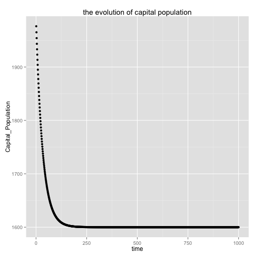
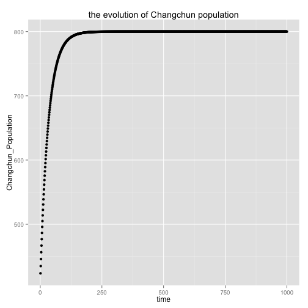
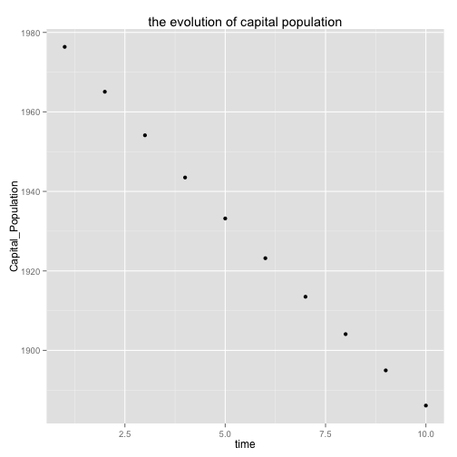
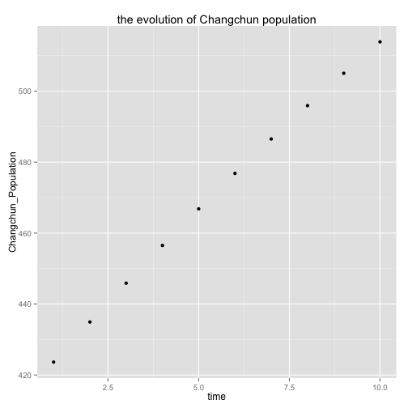

有趣的马尔可夫链:       模拟人口迁移
========================================================
author: Harry Zhu
date: 10/10/2014

========================================================


* 1.算法简介
* 2.编程过程
* 3.仿真结果

算法简介
========================================================
* 问题描述

近年来城镇化进程很快，东北老工业基地的人口却发展缓慢。
人口变动的原因为：

1. 出生

2. 死亡   （学术上：自然增长=出生-死亡）

3. 迁移  （学术上：机械增长）

其中人口迁移是一个复杂的动态过程

本次讲演重点讨论**迁移**在人口变化中的影响


算法简介
========================================================

* 解决思路

假定只讨论某两个地区之间的人口迁移，且以固定的概率迁移

通过已知的人口数量 和 两个地区之间人口迁移的概率可以求得每次迁移后的结果

然后依次迭代 直到不再迁移 得到最终的迁移结果


算法简介
========================================================
* 符号表示

时间：

 ```m``` →  ```k``` → ```n```

状态：

```i``` = ```m```时刻状态

```j``` = ```k```时刻状态

算法简介
========================================================
* 头疼的概念

* one-step 状态转移矩阵situation probability 某一步转移概率

$${P_{ij}}^{(m,m+1)} = \sum {{P_{ik}}^{(m,l)}{P_{kj}}^{(l,n)}}$$

* 每一次的结果 = 概率 * 上一次的结果


```r
##     口口口      口口口     口
##     口口口   =  口口口  *  口
##     口口口      口口口     口
```

算法简介
========================================================

```i``` 转移到 ```j```的条件概率矩阵叫作状态转移概率;形如:


```
      地区A 地区B
地区A   0.9   0.2
地区B   0.1   0.8
```

算法简介
========================================================

假设初始状态,形如:

```
      初始状态
地区A     2000
地区B      400
```


算法简介
========================================================
* time interval = ```n``` - ```m``` 时间间隔

* homogenious situation 齐次代表 方块矩阵

$${P_{ij}}^{(m,n+1)} ={P_{ij}}$$ 

* review
========================================================
时间： ```m``` →  ```k``` → ```n```

状态： ```i``` =  ```m```时刻状态,  ```j``` = ```k```时刻状态


```r
markov <- function(状态转移矩阵,终止时间,初始状态){  
起始时间 <- 1
markov <- 状态转移矩阵 %*% 初始状态
markovChain<-matrix(rep(0,终止时间),2,(终止时间))
markovChain[ ,1]<- 初始状态[ ,1]
for (转移次数 in 起始时间:终止时间) {
    markov <- 状态转移矩阵 %*% markov
    markovChain[1,转移次数]<-markov[1,1]
    markovChain[2,转移次数]<-markov[2,1]
} 
 return(markovChain)
}
```

仿真过程
========================================================

* 模拟长春和北京的人口迁移

* 假设长春初始有400万人

* 北京有2000万人

* 状态转移矩阵如下 


```r
状态转移矩阵 <- matrix(c(0.99, 0.01, 0.02, 0.98), 2, 2)
终止时间 <- 1000
初始状态 <- matrix(c(2000, 400))
```

仿真过程
========================================================


```r
马尔可夫链 <- markov(状态转移矩阵, 终止时间, 初始状态)
time <- 1:终止时间
Capital_Population <- 马尔可夫链[1, ]
Changchun_Population <-马尔可夫链[2, ]
```

首都人口
========================================================

 
* 解释：显然首都人口将保持在1600万人

长春人口
========================================================
 
* 解释：显然长春人口将保持在800万人


仿真过程
========================================================
* 修改终止时间


```r
终止时间 <- 10
```


首都人口
========================================================

 
* 解释：显然首都人口将线性下降

长春人口
========================================================
 
* 解释：显然长春人口将线性增加
可以提高的地方
========================================================

1. 可以进一步通过调查确定长春和北京之间人口迁移的概率
2. 进一步讨论齐次、非齐次等情况


